# Shader Graph

## Background

In order to lower the threshold for Shader development and expand the capabilities of procedural generation, and to encourage artists/technical artists to directly produce materials in Cocos Creator instead of third-party Digital Content Creation (DCC) tools, avoiding additional development work when importing materials, we have introduced a node-based material editor specifically designed for Cocos Creator.

This plugin relies on Cocos Creator version 3.8.2 and is developed based on our in-house open-source [Graph component](https://github.com/itharbors/ui/tree/main/element/graph) from the Web UI library.

To promote collaboration and innovation within the developer community, we have open-sourced the full set of source code for this plugin under the MIT license. This means developers are free to use, modify, and distribute this tool. We hope this project inspires more creativity within the community, and encourage everyone to contribute to the improvement of this tool by submitting pull requests.

---

GitHub：[shader-graph](https://github.com/knoxHuang/cocos-creator-extensions/tree/main/extensions/shader-graph)

---

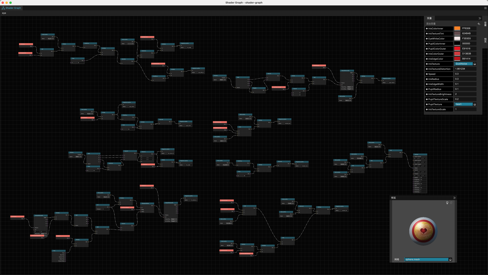

### Basic Structure

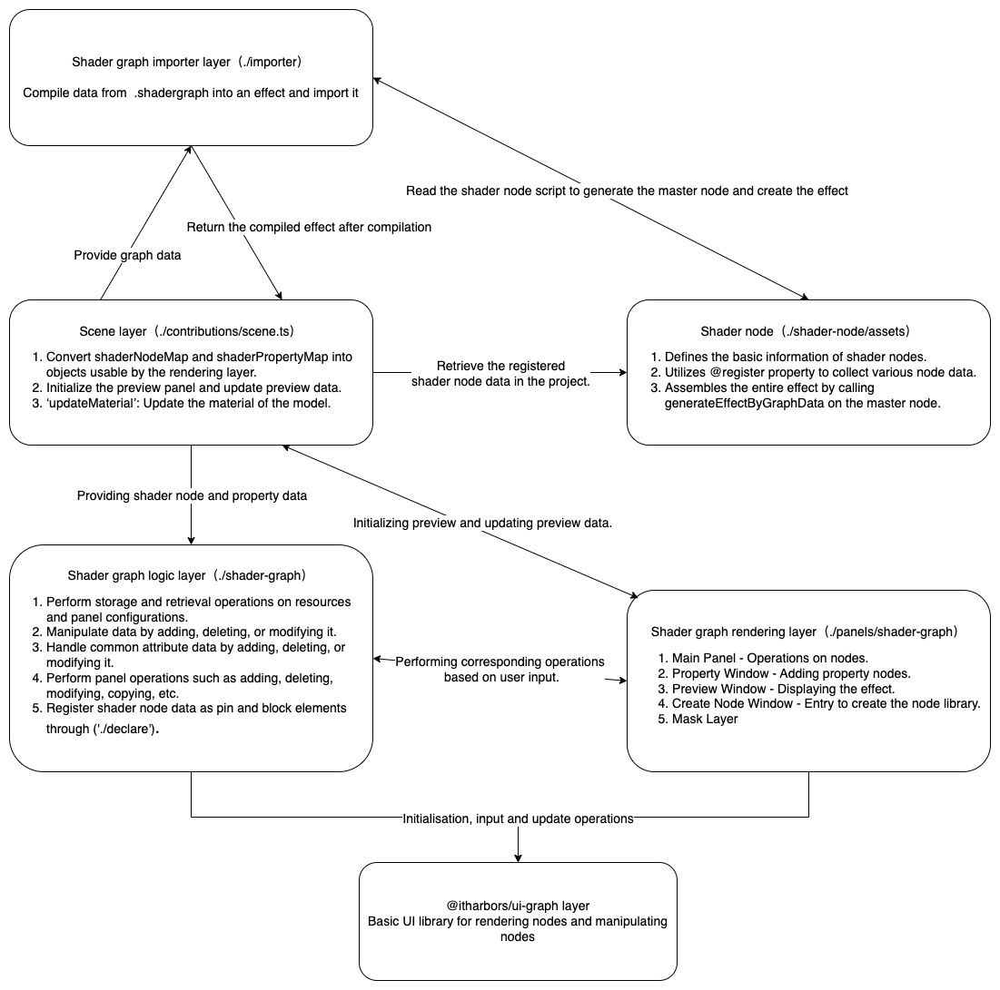

---

## Preparation Phase

1. Download Cocos Creator 3.8.2 editor and the shader-graph.zip plugin.
2. Open Cocos Creator 3.8.2 editor, go to the main menu, select **Extensions/Extension Manager** to open the Extensions panel.
3. Click 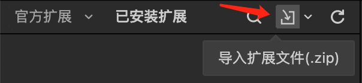, choose the **shader-graph.zip** extension file, and import it.
4. Restart the editor (Currently, for version 3.8.2, a restart is required to ensure the registration of **.shadergraph** assets. In future versions >= 3.8.3, this process will be improved, and a restart may not be necessary).

---

## Creating Asset

1. Right-click in the **Assets** panel, select **Create/Shader Graph** to create a **.shadergraph** asset.
   - Surface (Surface Shader)
   - Unlit (Unlit Shader)
2. Double-click the asset to enter the editing panel.
3. 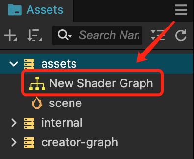

---

## How to Apply to Your Project

1. Create a new Material asset or select an existing one.
2. In the Inspector panel, locate the Effect property, and then click to choose the effect with the same name as the .shadergraph asset.

   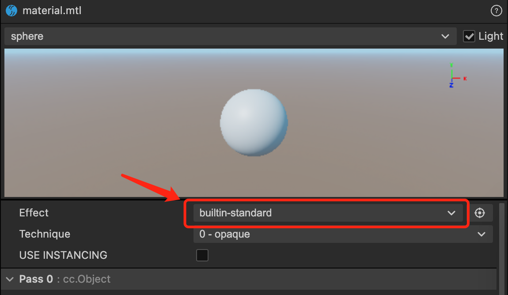

3. Assign the Material to your 3D node.

---

## Introduction to Panel Contents

Initial Panel:

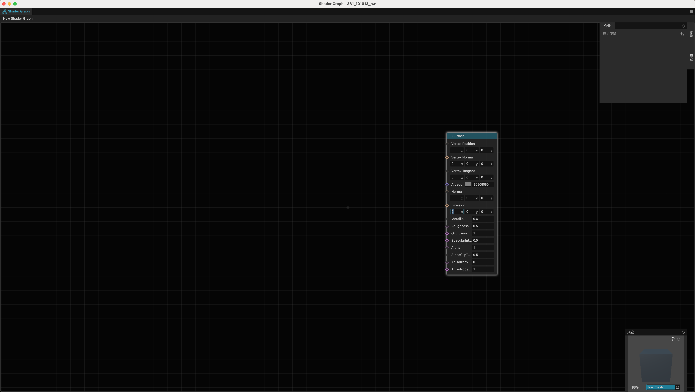

#### Property Window

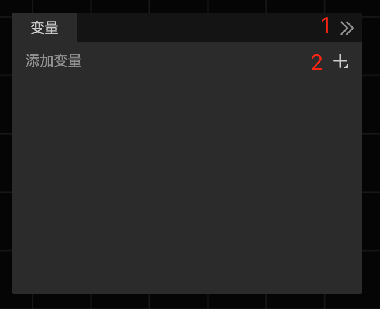

1. Close window
2. Create variable entry

The property window can create 8 types of variables:
- Float
- Boolean
- Vector2
- Vector3
- Vector4
- Color
- Texture2D
- TextureCube

#### Preview Window

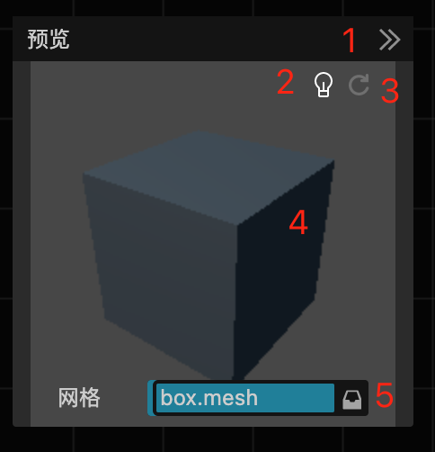

1. Close window
2. Switch lights (if Unlit, it has no effect)
3. Force refresh
   - When rendering or rotating modes fail, try refreshing.
4. Long press the left mouse button to rotate the model.
5. Switch between built-in or custom models.

#### Create Node Menu

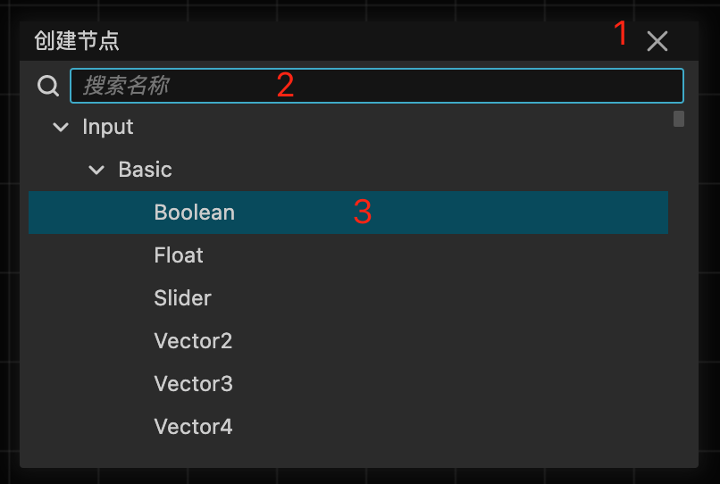

1. Close window
2. Enter the name of the node to create.
3. Press Enter to create the node directly (the initial position of the created node is where the mouse is pointing).

---

Using regular nodes:

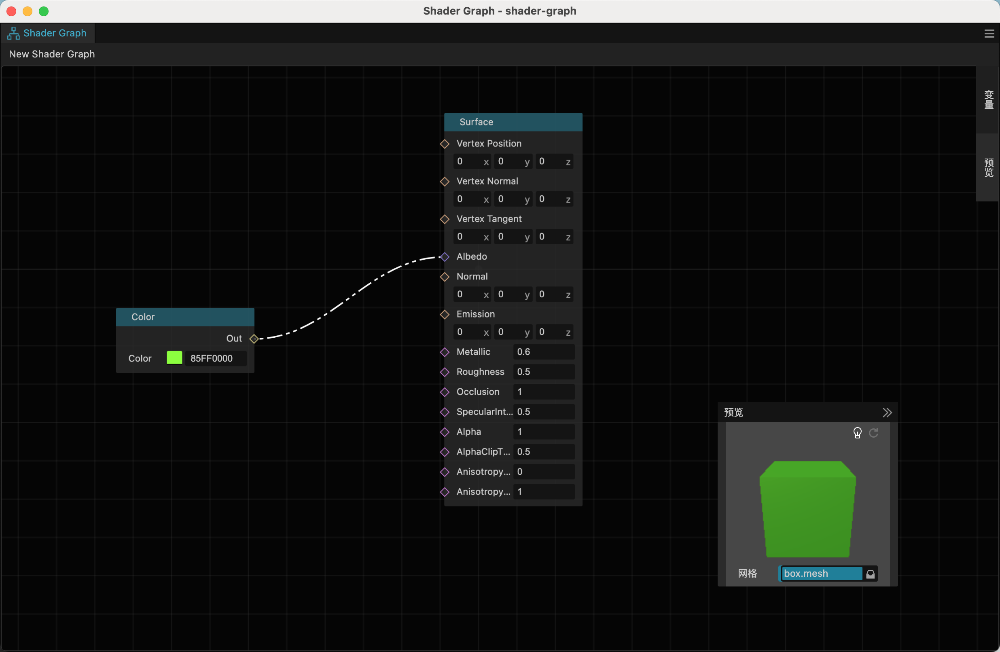

Using property nodes:

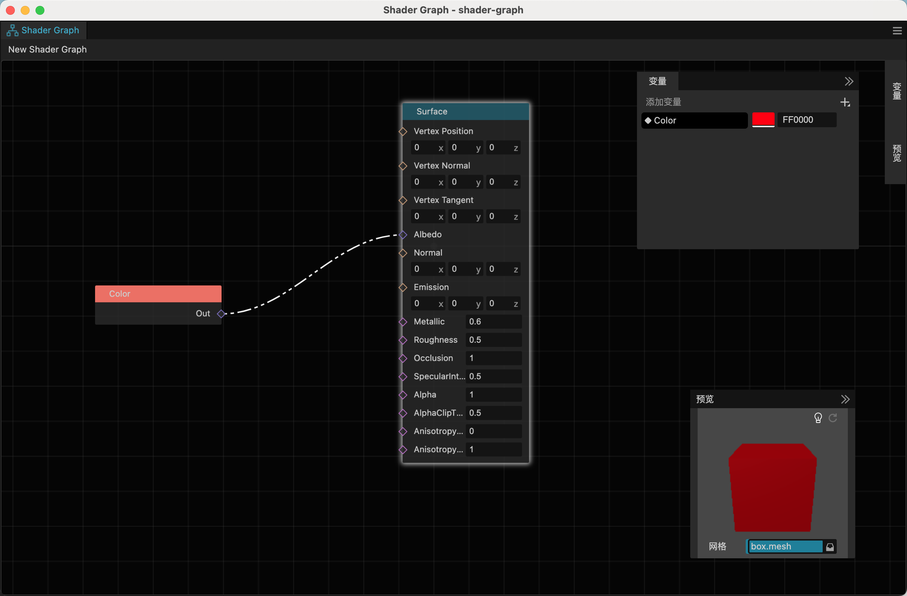

---

#### Node Library

For detailed content, refer to [link](shader-node/README.md)

---

### Keyboard Shortcuts

1. space - Open the create node menu
2. cmd+s/ctrl+s - Save
3. backspace/delete - Delete
4. cmd+c/ctrl+c - Copy
5. cmd+x/ctrl+x - Cut
6. cmd+v/ctrl+v - Paste
7. cmd+d/ctrl+d - Duplicate
8. cmd+z/ctrl+z - Undo
9. cmd+shift+z/ctrl+shift+z - Redo

----

### Command Line Compilation and Publishing

```bash
npm install - Initialize
npm run build - Compile
npm run pack - Package into a zip file

// If you want to see specific error messages, you can add --log to the end of the command line, e.g. npm run pack --log.
```
### Known issues

- Dynamic preview is not supported in the preview panel.
- Setting for nodes of type Texture2D is ineffective. You need to add a Texture2D type variable, connect it to the texture2D property, and finally set the effect in the Material.

### Development team

- Devs: Knox、Youyou
- Framework：VisualSJ
- PM：AndyTian
- UI/UX：派大星
- Director：Jare

