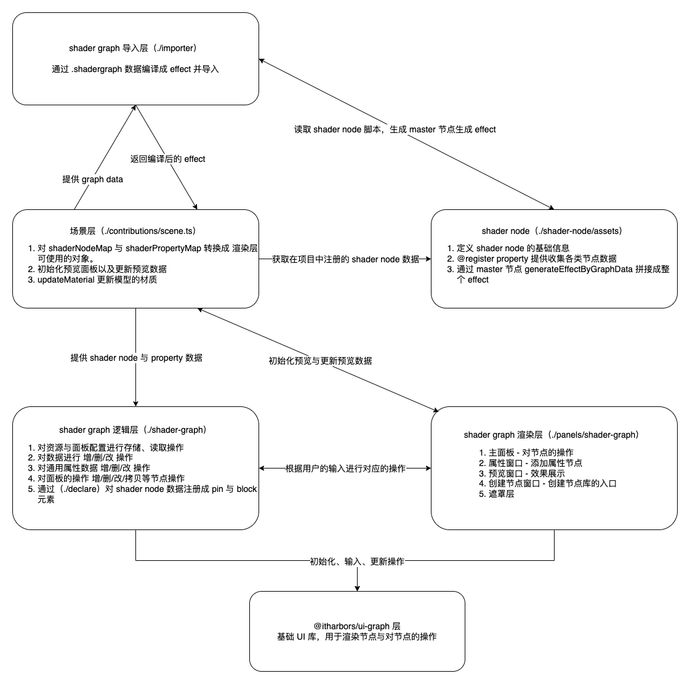
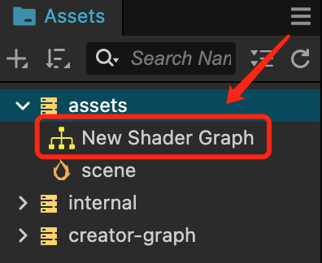
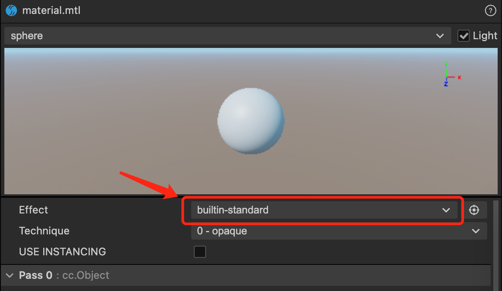
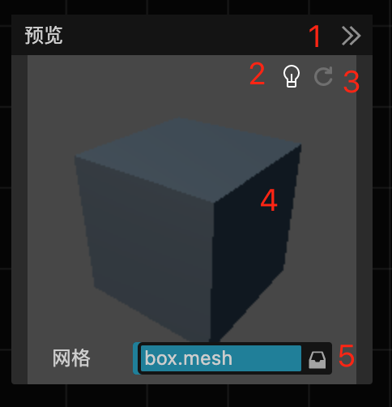
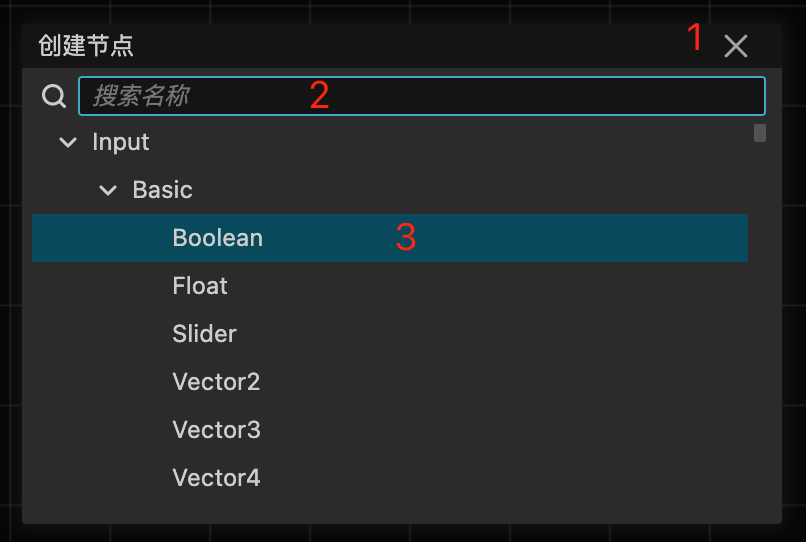
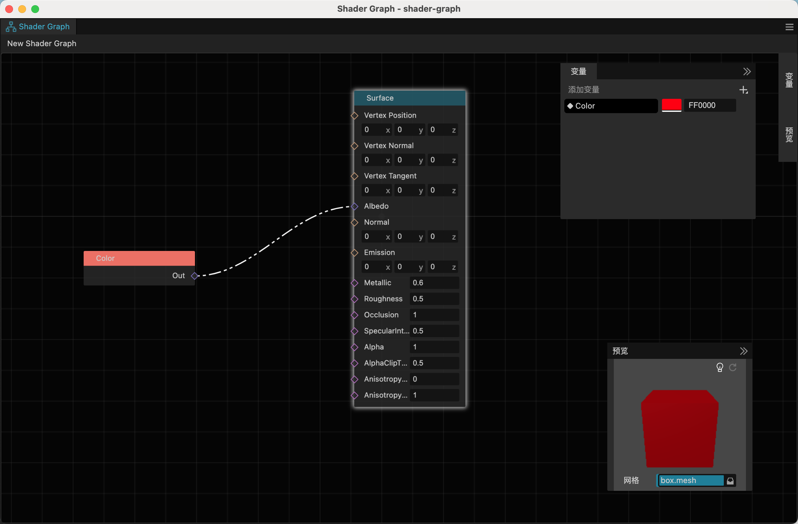

# Shader Graph

## 背景

为了降低 Shader 编写的门槛以及拓展程序化生成的能力，鼓励美术/TA 直接在 Cocos Creator 而不是第三方 DCC 中生产材质，避免导入材质时的二次开发工作，我们提供了一个针对 Cocos Creator 的节点材质编辑器。

该插件依赖 Cocos Creator 3.8.2 版本，并基于自研的开源 [Web UI 库中的 Graph 组件](https://github.com/itharbors/ui/tree/main/element/graph) 进行开发。

为了促进开发者社区的合作和创新，我们以 MIT 协议开源该插件的全套源码，这意味着开发者可以自由使用、修改和分发这一工具。期待这一项目能激发社区更多的灵感和创造力，希望大家在完善这个工具的时候不要藏着掖着，多多给我们提 PR！

### 源码

GitHub：[shader-graph](https://github.com/knoxHuang/cocos-creator-extensions/tree/main/extensions/shader-graph)


### 基本结构



---

## 准备阶段

1. 下载 Cocos Creator 3.8.2 编辑器 与 shader-graph.zip 插件。
2. 打开 Cocos Creator 3.8.2 编辑器，在主菜单中选择 **扩展/扩展管理器** 打开扩展面板。
3. 点击 ，选择 **shader-graph.zip** 扩展文件，进行导入。、
4. 需重启编辑器（**目前 3.8.2 需重启编辑器（为了确保 **.shadergraph** 资源注册生效），后续 >= 3.8.3 版本会完善该流程，可无需重启**）

---

## 创建资源

1. 到 **Assets** 面板右键选择 **创建/Shader Graph** 菜单进行创建 **.shadergraph** 资源
   - Surface (表面着色器)
   - Unlit (无光照着色器)
2. 双击资源，进入到编辑面板
3. 

---

## 如何应用到项目中

1. 新建或者选中一个 Material 资源。
2. 到属性检查器面板中找到 **Effect** 属性，然后点击选择 **.shadergraph** 资源同名的 effect。
   
   

3. 在把 Material 赋值给 3D 节点上即可。

---

## 面板内容介绍

初始面板：


#### 属性窗口


1. 关闭窗口
2. 创建属性入口

属性窗口可创建 8 种基础类型的属性节点分别是：

- Float
- Boolean
- Vector2
- Vector3
- Vector4
- Color
- Texture2D
- TextureCube

#### 预览窗口



1. 关闭窗口
2. 切换灯光（如果是 Unlit 无效果）
3. 强制刷新
   - 当遇到无法渲染或无法旋转模式可尝试刷新
4. 按住鼠标左键滑动，可旋转模型
5. 可切换内置或者自定义模型

#### 创建节点菜单



1. 关闭窗口
2. 输入需要创建的节点名
3. 回车可以直接创建节点（创建节点的初始位置是鼠标所指向的位置）

---

使用普通节点：


使用属性节点：



---

#### 节点库

详细内容可查看 [传送门](shader-node/README.zh-CN.md)

---

### 快捷键

1. space                     - 打开创建节点菜单
2. cmd+s/ctrl+s              - 保存
3. backspace/delete          - 删除
4. cmd+c/ctrl+c              - 拷贝
5. cmd+x/ctrl+x              - 剪切
6. cmd+v/ctrl+v              - 粘贴
7. cmd+d/ctrl+d              - 复制
8. cmd+z/ctrl+z              - 撤销
9. cmd+shift+z/ctrl+shift+z  - 重做

----

### 命令行编译与发布

```
npm install - 初始化
npm run build - 编译
npm run pack - 打包成 zip 包
// 如果要查看具体报错信息，可以在命令行后面加 --log 例如：npm run pack --log
```

### 已知问题

- 预览面板不支持动态预览。
- 对 Texture2D 类型的节点进行设置是无效的。您需要添加一个 Texture2D 类型变量，将其连接到 texture2D 属性，最后在材质中设置效果。

### 开发团队

- Devs: Knox、Youyou
- Framework：VisualSJ
- PM：AndyTian
- UI/UX：派大星
- Director：Jare
