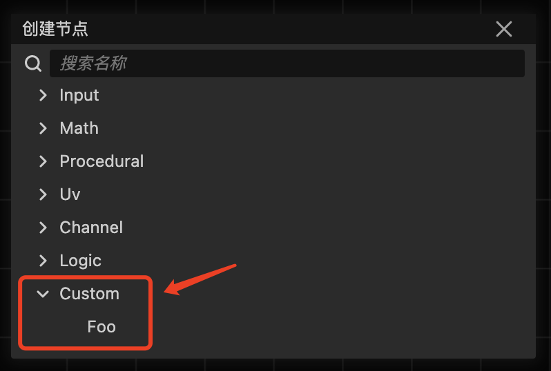
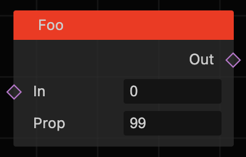

## Shader Node

用于创建与解析 shader node

---

### 自动创建节点库

节点库的代码是通过执行 **.scripts/generate.js** 对 **shader-templates** 内部定义的 **chunk 与 master** 进行解析，动态
创建代码到 **assets/operation** 目录下。

**模版**
- chunk
    - common
    - input_basic
    - math
    - noise
    - range
    - shape
    - uv
- master
    - SurfaceMasterNode
    - UnlitMasterNode

---

**生成后的节点**
- Input
    - Basic
        - Float
        - Boolean
        - Slider
        - Vector2
        - Vector3
        - Vector4
        - Color
        - Time
    - Geometry
        - NormalVector
        - Position
        - UV
        - VertexColor
        - ViewDirection
    - Texture
        - SimpleTexture2D
    - Variable
        - GetLocalVar
        - RegisterLocalVar
- Math
    - Advanced
        - Absolute
        - Exponential
        - Length
        - Log
        - Module
        - Negate
        - Normalize
        - Posterize
        - ReciprocalSquare
        - Reciprocal
    - Basic
        - Add
        - Divide
        - Multiply
        - Power
        - Square
        - Substract
    - Derivative
        - DDX
        - DDXY
        - DDY
    - Interpolation
        - InverseLerp
        - Lerp
        - Smoothstep
    - Range
        - Clamp
        - Fraction
        - Max
        - Min
        - OneMinus
        - RandomRange
        - Remap
        - Saturate
    - Round
        - Ceil
        - Floor
        - Round
        - Sign
        - Step
        - Truncate
    - Trigonometry
        - Arccosine
        - Arcsine
        - Arctangent
        - Arctangent2
        - Cosine
        - DegressToRadians
        - HyperbolicCosine
        - HyperbolicSine
        - Hyperbolic
        - RadiansToDegrees
        - Sine
        - Tangent
    - Vector
        - CrossProduct
        - Distance
        - DotProduct
        - Fresnel
        - Projection
        - Reflection
        - SphereMask
    - Wave
        - NoiseSineWave
        - SawtoothWave
        - SquareWave
        - TriangleWave
- Procedural
    - Noise
        - GradientNoise
        - SimpleNoise
    - Shape
        - Ellipse
        - Rectangle
        - RoundRectangle
- Uv
    - PolarCoordinates
    - RotateCoordinates
    - TillingAndOffset
- Channel
    - Combine
    - Split
- Logic
    - AI
    - And
    - Any
    - Branch
    - Comparison
    - IsNan
    - Not
    - Or

---

## 如何定义节点类

```typescript
// 这路径需要根据你存放的路径进行修改
import { register } from '../../../../graph/register';
import { ShaderNode } from '../../../base';
import { slot } from '../../../utils';

@register({
    // 创建节点的菜单
    menu: 'Custom/Foo',
    // 节点的名字
    title: 'Foo',
    // 节点的样式
    style: {
        headerColor: '#ff1e00'
    },
    // 是否是主节点（主节点不会被删除，只有一个主节点）
    master: false,
})
export class Foo extends ShaderNode {
    // 定义节点上的属性
    // slot 与 prop 相近，都是定义节点上属性的信息
    // 参数一[string]：名字
    // 参数二[any]：默认值
    // 参数三[string]：类型
    // 参数四[string]：连接的类型
    // 参数五[Object]：自定义对象
    data = {
        // 输入属性列表
        inputs: [
            slot('In', 0, 'float', 'vector'),
        ],
        // 输出属性列表
        outputs: [
            slot('Out', 0, 'float', 'vector'),
        ],
        // 属性列表
        props: [
            prop('Prop', 99, 'float'),
        ],
    };

    /**
     * 生成 effect 
     */    
    generateCode() {
        const input0 = this.getInputValue(0);
        const output0 = this.getOutputVarDefine(0);
        
        return `
            ${output0} = ${input0};
        `;
    }
}
```

### 效果图：

菜单：



节点：



---

### 已知问题

- Boolean 变量目前暂不支持
